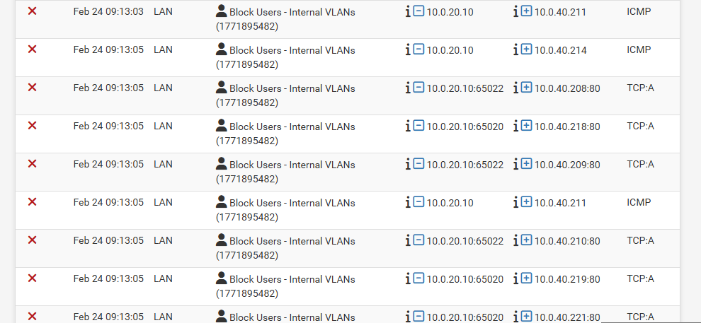
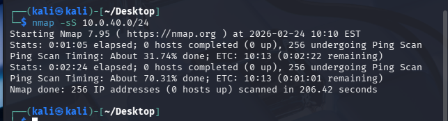

# Zero-Trust Enterprise Network Security Lab

## Project Overview

This lab simulates a security-focused enterprise network designed using Zero-Trust principles. The objective was to move beyond basic VLAN configuration and instead build, enforce, and validate a segmented architecture capable of containing lateral movement and reducing internal attack surface.

The environment was intentionally designed to reflect real-world enterprise security controls, including zone-based segmentation, DMZ isolation, restricted egress policies, controlled public exposure, and adversarial validation testing.

This project focuses not just on configuration, but on control validation.

---

## Objectives

- Design a segmented, zone-based enterprise network
- Enforce strict east-west isolation between VLANs
- Deploy and expose a hardened DMZ service
- Restrict server outbound (egress) traffic
- Implement IDS/IPS inspection
- Simulate a compromised endpoint
- Validate containment through logged enforcement

---

## Network Architecture

The lab is structured around a zone-based model:

| Zone    | Purpose                  | Subnet         |
|----------|--------------------------|---------------|
| VLAN10   | Management               | 10.0.10.0/24  |
| VLAN20   | User Workstations        | 10.0.20.0/24  |
| VLAN30   | Internal Servers         | 10.0.30.0/24  |
| VLAN40   | DMZ (Public Services)    | 10.0.40.0/24  |
| VLAN50   | Security Tools           | 10.0.50.0/24  |
| VLAN99   | Untrusted / Guest        | 10.0.99.0/24  |

All VLANs are isolated by default. No implicit trust exists between segments.

---

## Security Controls Implemented

### 1. Zero-Trust Inter-VLAN Policy
- Explicit deny rules between security zones
- No lateral movement permitted without defined allow rules
- All deny events logged for visibility

### 2. Controlled DMZ Exposure
- IIS web server deployed in DMZ (10.0.40.2)
- WAN access configured via NAT and explicit firewall rule
- No internal VLAN access to DMZ

### 3. Server Egress Restrictions
- Servers limited to outbound TCP 80 and 443 only
- All other outbound traffic denied
- Reduces risk of reverse shell callbacks or unauthorized beaconing

### 4. IDS/IPS Deployment
- Suricata configured with ET Open rules
- HOME_NET properly defined
- Inline inspection enabled
- Block policy configured

---

## Adversarial Validation

To validate enforcement effectiveness, a simulated compromised endpoint was deployed in the User VLAN.

Reconnaissance attempts were performed using Nmap:

- SYN scan
- Subnet sweep
- Targeted service scans

All attempts to enumerate the DMZ subnet were blocked by explicit inter-VLAN policy.

Firewall logs confirmed:
- Source IP
- Destination IP
- Matched rule
- Timestamped enforcement

This demonstrated successful containment of lateral movement from user to DMZ zone.

---

## Key Takeaways

- Segmentation must be explicitly enforced, not assumed.
- East-west containment is as critical as perimeter defense.
- Logging and validation are essential to proving control effectiveness.
- Defensive architecture should be tested using adversarial techniques.

---

## Project Focus

This lab emphasizes defensive engineering:

- Threat modeling
- Control design
- Adversarial simulation
- Validation through logged evidence

The goal was to demonstrate practical network security engineering beyond basic configuration tasks.

